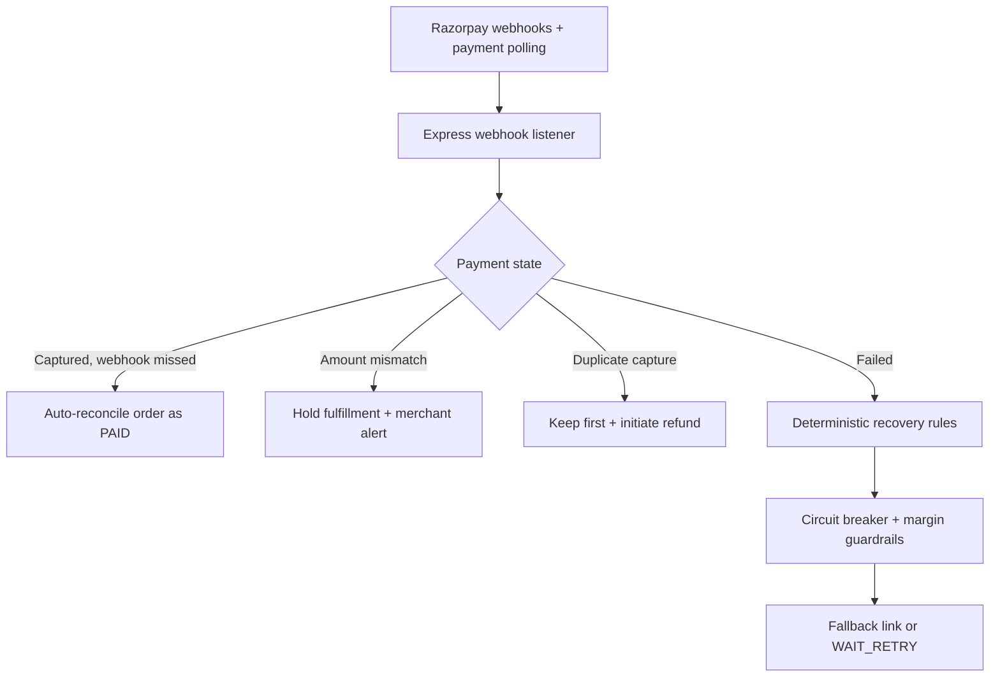

# RazorRecover AI

RazorRecover AI is a deterministic Razorpay payment resilience engine. It recovers failed checkouts, auto-reconciles missed success webhooks, detects underpayments, initiates duplicate refunds, and enforces financial guardrails without external AI dependencies.

## Architecture



## Project Files

```text
src/             React dashboard
server.ts        Express API entrypoint
server/          Recovery, reconciliation, circuit, margin, and audit services
python-export/   Standalone FastAPI webhook bundle
docs/            Architecture and demo documentation
public/          Static assets
```

The root project is the full dashboard and API application:

- [`server.ts`](server.ts): Express API, webhook listener, recovery engine, and reconciliation routes.
- [`server/deterministicRecovery.ts`](server/deterministicRecovery.ts): deterministic failure classification and recovery rules.
- [`server/reconciliation.ts`](server/reconciliation.ts): missed-webhook, mismatch, and duplicate-payment reconciliation.
- [`src/App.tsx`](src/App.tsx): live operations dashboard and demo controls.

The standalone Python submission is in [`python-export`](python-export):

- [`main.py`](python-export/main.py): FastAPI webhook listener, reconciliation, guardrails, and recovery response.
- [`test_scenarios.py`](python-export/test_scenarios.py): Three deterministic webhook scenarios.
- [`requirements.txt`](python-export/requirements.txt): Python dependencies.
- [`.env.example`](python-export/.env.example): Optional Razorpay configuration.

More detail: [`docs/ARCHITECTURE.md`](docs/ARCHITECTURE.md) and [`docs/DEMO_SCRIPT.md`](docs/DEMO_SCRIPT.md).

## Local Setup: Full Dashboard

```powershell
npm.cmd install
npm.cmd run dev
```

Open `http://localhost:3000`.

Frontend views are available at:

- `/`: product home and live engine explanation.
- `/checkout`: customer payment and recovery flow.
- `/merchant`: merchant revenue and bank-health dashboard.
- `/admin`: technical operations console with scenarios, audit logs, controls, and reconciliation.
- `/proof`: latest decision proof and live event reasoning.

### Optional: Razorpay Test Checkout

The customer view supports real Razorpay Test Mode Checkout when both credentials are configured on the server. Copy `.env.example` to `.env` and set:

```text
RAZORPAY_KEY_ID=rzp_test_your_key_id
RAZORPAY_KEY_SECRET=your_test_secret
```

Only `RAZORPAY_KEY_ID` is sent to the browser. The secret is used only by Express to create test orders and verify the Razorpay HMAC signature. Never commit `.env` or expose `RAZORPAY_KEY_SECRET` in frontend code.

When credentials are missing, the dashboard intentionally remains in local deterministic demo mode. The home screen shows which mode is active.

## Local Setup: Python Webhook Bundle

```bash
git clone https://github.com/yourusername/razorrecover-ai.git
cd razorrecover-ai/python-export
pip install -r requirements.txt
copy .env.example .env
uvicorn main:app --reload
python test_scenarios.py
```

The scenarios demonstrate bank downtime recovery with an authorized 5% discount, `HALT_ALREADY_PAID` double-payment protection, and insufficient-funds retry with a 0% discount.

## Auto-Reconciliation Demo

The dashboard includes three deterministic reconciliation simulations through `POST /api/reconcile`:

- `missed_webhook`: matches a captured payment to a pending order and marks it PAID.
- `amount_mismatch`: holds fulfillment and reports the shortfall to the merchant.
- `duplicate_payment`: preserves the first capture and initiates a refund for the extra capture.

This models a five-minute polling worker while keeping the demo local and repeatable. In production, the in-memory fixtures can be replaced with Razorpay `payments.list()` and the merchant order database.

The engine runs with deterministic rules and requires no AI API key.

## Honest Design Notes

Bank health status and WhatsApp delivery are simulated via local JSON endpoints for deterministic testing. Razorpay order reconciliation uses the local paid-order fixture first and attempts the Razorpay API only when configured.

The recovery policy caps `discount_percent` at 10%, then applies the lower item-margin ceiling as defense in depth.
