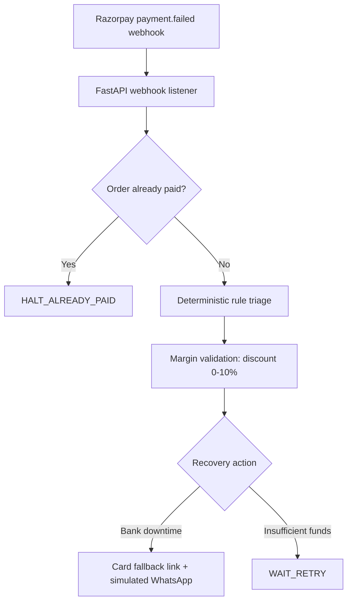

# RazorRecover AI

RazorRecover AI is an automated backend recovery engine for failed Razorpay payments. It uses deterministic failure rules, reconciles order state, and chooses targeted recovery actions with strict discount guardrails.

## Architecture



## Submission Bundle

- `main.py`: FastAPI webhook listener, reconciliation, guardrails, and recovery response.
- `deterministicRecovery.ts`: deterministic failure classification and recovery rules.
- `test_scenarios.py`: Three deterministic webhook scenarios.
- `requirements.txt`: Python dependencies.
- `.env.example`: Optional Razorpay configuration.

## Local Setup

```bash
git clone https://github.com/yourusername/razorrecover-ai.git
cd razorrecover-ai/python-export
pip install -r requirements.txt
copy .env.example .env
uvicorn main:app --reload
python test_scenarios.py
```

The test runner sends three payloads to `http://127.0.0.1:8000/webhook/payment.failed`:

1. `GATEWAY_TIMEOUT`: generates a Card fallback with an authorized 5% discount.
2. An already-paid order: halts with `HALT_ALREADY_PAID` and suppresses recovery.
3. Insufficient funds: returns `WAIT_RETRY` with a 0% discount.

The engine runs with deterministic rules and requires no AI API key.

## Demo Safety Check

The recovery policy caps `discount_percent` at 10%, then applies the lower item-margin ceiling as defense in depth.

## Honest Design Notes

Bank health status and WhatsApp delivery are simulated via local JSON endpoints for deterministic testing. Razorpay order reconciliation uses the local paid-order fixture first and attempts the Razorpay API only when configured.
